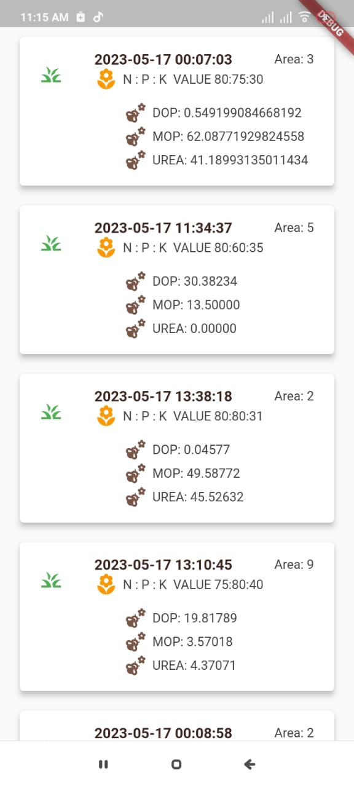
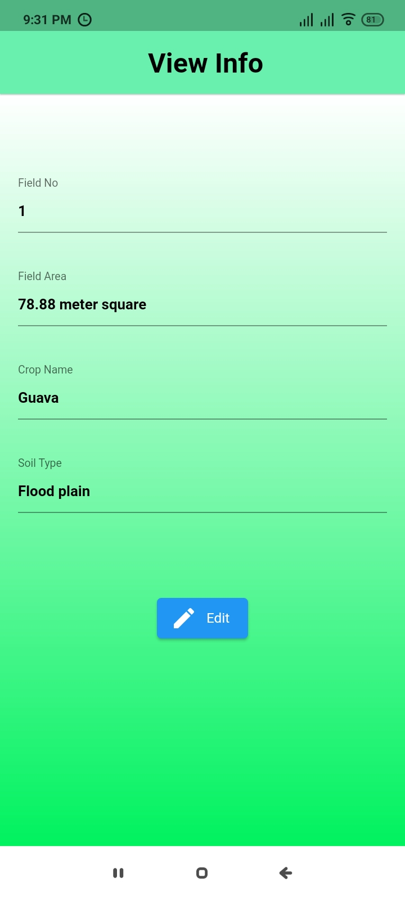

# farmer

# Youtube Demonstration

## Getting Started
# Images
## ARCHITECTURE

## Esp 32 Code For Irrigation Control
[./A4__IDP_HARDWARE_CODE.ino](./A4__IDP_HARDWARE_CODE.ino)

## App Pages

| Log In Signup page          | Signup page                 | Account Verification page      |
|-----------------------------|-----------------------------|--------------------------------|
|  |  |  |

| Log In page                 | Reset password page         | Home Page                     |
|-----------------------------|-----------------------------|-------------------------------|
|  |  |  |

### Dynamic Notification
  
  

### Navbar
  

### Weather Forecast
  

### Pointed Shops and Agricultural Office
  

### Irrigation History
  

### Fertilizer Recommendation Input
  

### Recommended Fertilizers
  

### Previous Recommendation
  

### Set Crop For The Fields
  

### Set Required Info For That Field Or Update It
  

