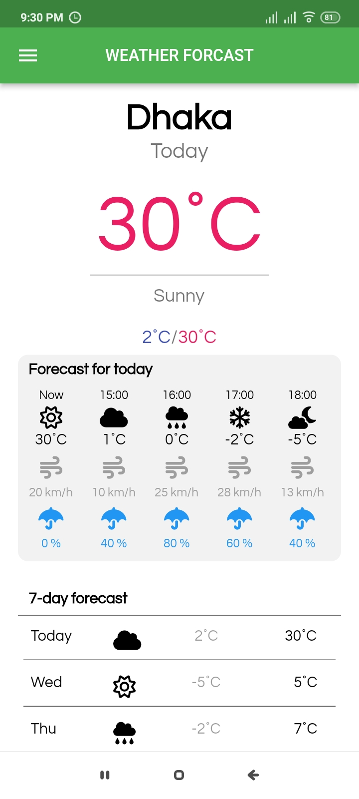
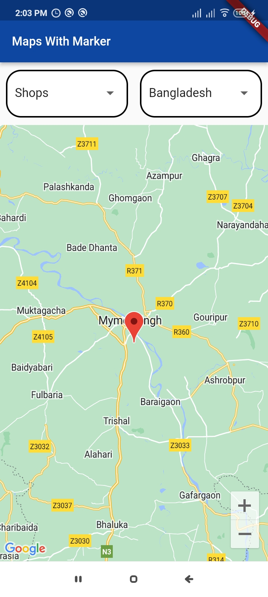

# farmer

# Youtube Demonstration

## Getting Started
# Images
## ARCHITECTURE

## Esp 32 Code For Irrigation Control
[./A4__IDP_HARDWARE_CODE.ino](./A4__IDP_HARDWARE_CODE.ino)

## App Pages

## App Pages

  

    
Log In Signup page

    
  

  

    
Signup page

    
  

  

    
Account Verification page

    
  

  

    
Log In page

    
  

  

    
Reset password page

    
  

  

    
Home Page

    
  

### Dynamic Notification
  
  

### Navbar
  

### Weather Forecast
  

### Pointed Shops and Agricultural Office
  

### Irrigation History
  

### Fertilizer Recommendation Input
  

### Recommended Fertilizers
  

### Previous Recommendation
  

### Set Crop For The Fields
  

### Set Required Info For That Field Or Update It
  

