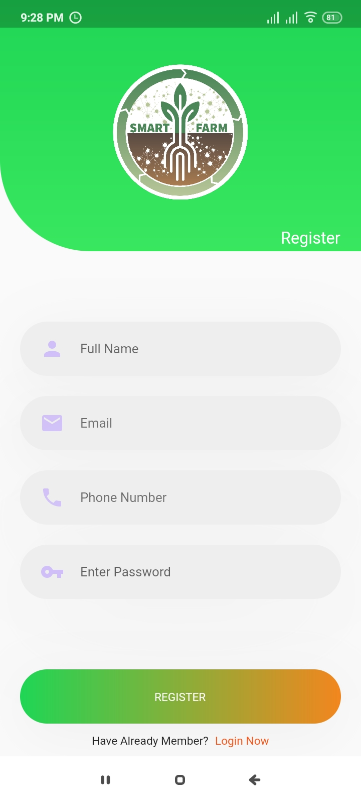
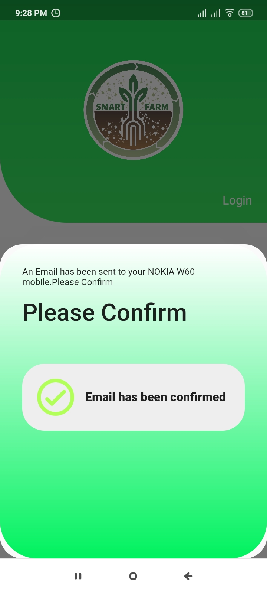
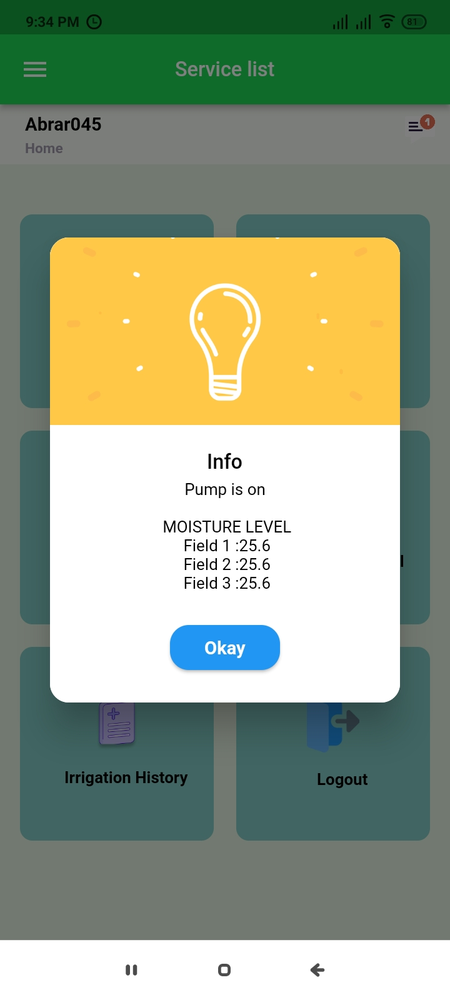

# farmer

A new Flutter project.

## Getting Started
# Images
## ARCHITECTURE

## Esp 32 Code For Irrigation Control
./A4__IDP_HARDWARE_CODE.ino

## App Pages
### Log In Signup page

### Signup page
 

### Account Verification page
 

### Log In page
 

### Reset password page
 

### Home Page
 

### Dynamic Notification

### Navbar
 

### Weather Forecast
 

### Pointed Shops and Agricultural Office
 

### Irrigation History

### Fertilizer Recommendation Input
 

### Recommended Fertilizers
 

### Previous Recommendation

### Set Crop For The Fields

### Set Required Info For That Field Or Update It
 

